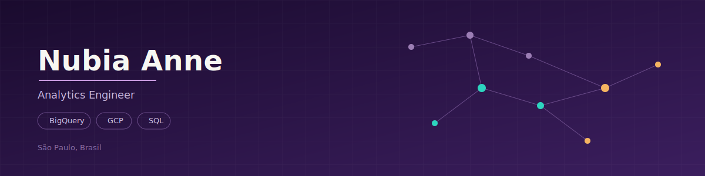

  

  
  
  

  
  

---

- 📊 Analytics Engineer no **Grupo Boticário**, trabalhando com pipelines de dados em BigQuery/GCP
- 🔄 Migrei de Relações Internacionais para engenharia de dados há cerca de 1 ano e meio
- 🎓 Formanda em Relações Internacionais e Estudos de Segurança Nacional (UFABC) · trilha de Data Science no Bootcamp [RE]Start
- 🐍 Apaixonada por dados, Python e Machine Learning
- 🗣️ PT-BR nativo · inglês avançado · espanhol básico · aprendendo Libras

Como uma programadora raiz, não vivo sem café! ☕ Se você quiser trocar uma ideia sobre dados, GCP ou transição de carreira, será um prazer conversar com você. Obrigada por se conectar comigo!

---

📍 São Paulo, Brasil
📫 github.com/anneetwo

---

### Tecnologias (Technologies)

  &nbsp;
  &nbsp;
  &nbsp;
  &nbsp;
  &nbsp;
  &nbsp;
  &nbsp;
  

---

  

